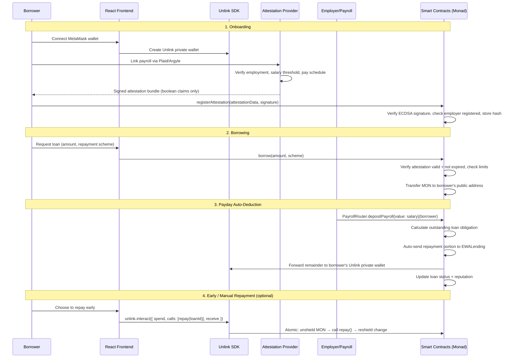

# Earned Wage Access (EWA) Protocol — Monad × Unlink

Privacy-preserving earned wage access on Monad L1. Borrowers prove payroll eligibility via cryptographic attestations without revealing salary, employer, or history. Loans disburse through the protocol and **repayments are auto-deducted from payroll deposits** — when an employer sends wages through the PayrollRouter contract, the protocol automatically takes its cut before forwarding the remainder to the borrower. All flows leverage Unlink's shielded pool so amounts stay private on-chain.

## User Review Required

> [!IMPORTANT]
> **Token choice**: Using native MON (confirmed).

> [!IMPORTANT]
> **Attestation model — How we verify payroll is legit**: The attestation provider (our server) connects to payroll platforms via **Plaid Income / Argyle** APIs to verify real employment data. The flow:
> 1. Borrower links their payroll account (e.g. ADP, Gusto, Rippling) through Plaid/Argyle OAuth
> 2. Our server pulls verified data: employer name, employment status, salary range, pay schedule
> 3. Server signs a structured attestation claim (e.g. `{employed: true, salaryAbove: 3000, employer: hash("Company X"), paySchedule: "biweekly"}`) — only boolean/threshold claims, never raw values
> 4. Smart contract verifies the ECDSA signature from our trusted provider key, stores the attestation hash on-chain
> 5. **On-chain employer registry**: `AttestationRegistry` maintains a mapping of `employerHash → isRegistered`. Only employers who have enrolled their payroll system through our partnership are accepted. This prevents fake employer claims.
>
> For the **hackathon MVP**, the Plaid/Argyle integration is simulated by a Hardhat script that signs attestations directly. The on-chain verification logic is real.

> [!IMPORTANT]
> **Employment changes — What if the borrower quits or changes jobs?**
> - **Attestation expiry**: Each attestation has a 30-day TTL. Borrowers must re-attest monthly to maintain borrowing eligibility. New loans require a valid (non-expired) attestation.
> - **Missed payroll detection**: If the PayrollRouter receives no `depositPayroll()` for a borrower past their expected payday + grace period (7 days), the loan is flagged as `AT_RISK`.
> - **Employment termination flow**: When the attestation provider detects employment ends (via Plaid/Argyle webhook), it calls `AttestationRegistry.revokeAttestation(borrower)`. This blocks new borrowing immediately. Existing loans remain active — they're still repayable via manual repayment or the new employer's payroll if the borrower re-enrolls. If no repayment within 30 days of revocation → auto-liquidation.
> - **Job change**: Borrower re-enrolls with new employer. New attestation issued, old one revoked. PayrollRouter updated to new employer's address. Existing loan obligations carry over.

> [!WARNING]
> **Monad testnet access**: Deployment requires MON from [faucet.unlink.xyz](https://faucet.unlink.xyz).

---

## Architecture

### Actors

| Actor | Description |
|---|---|
| **Borrower** | Employee who borrows against earned wages. Creates Unlink private wallet, submits attestation proofs, borrows. Repayment is automatic from payroll. |
| **Protocol (Us)** | We are the credit provider (like Klarna). We fund the `EWALending` contract with liquidity. There is no third-party lender marketplace. |
| **Attestation Provider** | Off-chain server that verifies employment/salary data from payroll APIs and issues signed attestation claims. In the MVP, a Hardhat script. |
| **Employer / Payroll System** | Sends wages through the `PayrollRouter` contract instead of directly to the employee. The router auto-deducts outstanding loan obligations before forwarding the remainder. In the MVP, simulated by a script. |
| **Smart Contracts** | `AttestationRegistry`, `EWALending`, `PayrollRouter`, `ReputationTracker` |

### User Flows



### Payment Schemes

All schemes auto-deduct from the borrower's next payroll deposit(s) via PayrollRouter.

| Scheme | Description | Auto-Deduction Behavior | Interest Model |
|---|---|---|---|
| **Single Paycheck** | Full repayment from next payday. | 100% of (principal + fee) deducted from next payroll deposit. | Flat fee: 2% of principal |
| **Installments** | 2-4 equal payments over consecutive pay periods. | Each payday, one installment is deducted. Remainder forwarded to borrower. | 5% APR prorated over term |
| **Deposit-Backed** | Borrower locks collateral (pre-deposited MON); lower rate. If payroll misses, collateral covers. | Normal deduction from payroll; collateral released on full repay. | 1% flat fee |
| **Dynamic Interest** | Rate adjusts based on on-chain reputation score (0-100). Higher rep → lower rate. | Same as Single or Installment, but interest calculated using reputation. | Base 8% APR, −0.05% per rep point |

---

## Proposed Changes

### Smart Contracts (Hardhat + Solidity)

#### [NEW] hardhat.config.ts
Hardhat config with Monad testnet network (chain 10143), Solidity 0.8.24.

#### [NEW] contracts/AttestationRegistry.sol
- Stores attestation hashes mapped to borrower addresses
- `registerEmployer(bytes32 employerHash)` — owner registers verified employer hashes
- `registerAttestation(bytes32 attestationHash, bytes32 employerHash, uint256 expiry, bytes signature)` — verifies ECDSA sig from trusted provider, checks employer is registered, stores attestation with 30-day TTL
- `revokeAttestation(address borrower)` — attestation provider or owner revokes (e.g. on employment termination)
- `isValid(address borrower)` — checks attestation exists, not expired, and not revoked
- Owner can update trusted provider address

#### [NEW] contracts/PayrollRouter.sol
The core repayment mechanism. Employer (or payroll system) calls this instead of sending wages directly to the employee.
- `registerEmployee(address employee, address lendingContract)` — owner links employee to their lending contract
- `depositPayroll(address employee) payable` — employer sends wages; the router:
  1. Queries `EWALending.getOutstandingObligation(employee)` for amount due this period
  2. Sends the deduction amount to `EWALending.repayFromPayroll(employee)` 
  3. Forwards the remainder to the employee's address
  4. Emits `PayrollProcessed(employee, totalDeposit, deducted, forwarded)`
- `setNextPayday(address employee, uint256 timestamp)` — owner sets expected payday date
- `getNextPayday(address employee) → uint256` — view helper

#### [NEW] contracts/EWALending.sol
- Core lending contract; protocol-funded (owner deposits liquidity)
- `depositLiquidity()` — owner funds the pool (payable)
- `borrow(uint256 amount, RepaymentScheme scheme)`:
  - Checks `AttestationRegistry.isValid(msg.sender)`
  - Checks amount ≤ max loan cap
  - Checks no existing delinquent loan
  - Calculates interest based on scheme + reputation
  - Creates `Loan` struct, transfers MON to borrower
- `repayFromPayroll(address borrower) payable` — called by `PayrollRouter` only; applies incoming payroll funds against outstanding loan obligation
- `repay(uint256 loanId) payable` — manual/early repayment fallback (borrower or via Unlink interact)
- `getOutstandingObligation(address borrower) → uint256` — returns amount due this pay period (used by PayrollRouter to calculate deduction)
- `liquidate(uint256 loanId)` — owner can liquidate overdue loans (marks default, slashes reputation)
- `getLoan(uint256 loanId)` — view loan details
- `getActiveLoans(address borrower)` — view borrower's loans

#### [NEW] contracts/ReputationTracker.sol
- `getReputation(address borrower) → uint256` (0-100 scale)
- `recordRepayment(address borrower, uint256 loanAmount, bool onTime)` — called by EWALending on repayment, weighted by loan size
- `recordDefault(address borrower, uint256 loanAmount)` — called on liquidation, weighted by loan size
- Reputation formula (amount-weighted):
  - Starts at 50
  - On-time repay: `+min(10, 3 + loanAmount / TIER_SIZE)` — small loans give +3, larger loans up to +10
  - Default: `−min(25, 10 + loanAmount / TIER_SIZE)` — small default −10, large default up to −25
  - `TIER_SIZE` = 1 MON (configurable), determines how quickly amount affects score
  - Capped at [0, 100]

#### [NEW]contracts/InterestCalculator.sol
- Pure/view library for interest math
- `calculateInterest(uint256 principal, RepaymentScheme scheme, uint256 reputation) → uint256`
- `getInstallmentAmount(uint256 totalOwed, uint256 numInstallments) → uint256`
- `getPeriodicObligation(Loan loan) → uint256` — returns how much should be deducted from this payroll cycle
- Used by EWALending and PayrollRouter internally

#### [NEW] scripts/deploy.ts
Deploys all contracts, links them, funds liquidity pool.

#### [NEW] scripts/issue-attestation.ts
Simulates attestation provider: signs attestation for a given borrower address, outputs the data needed to call `registerAttestation()`.

#### [NEW] scripts/simulate-payroll.ts
Simulates an employer depositing payroll through the `PayrollRouter`. Sets payday, then calls `depositPayroll()` with a specified amount. Prints the split (deduction vs. remainder forwarded to borrower).

#### [NEW] test/EWALending.test.ts
Hardhat tests covering:
- Attestation registration + validation
- Borrow with valid attestation
- Borrow rejection (invalid/expired attestation, over limit)
- Payroll auto-deduction (full single-paycheck, installment split, remainder forwarding)
- Manual early repayment fallback
- Interest calculation across all 4 schemes
- Reputation updates (on-time payroll deduction, early repay bonus, default penalty)
- Liquidation flow

---

### Frontend (React + Vite + Unlink SDK)

#### [NEW] frontend/package.json
React 18 + Vite + TypeScript. Dependencies: `@unlink-xyz/react@canary`, `@unlink-xyz/core`, `wagmi`, `viem`, `ethers`.

#### [NEW] frontend/src/main.tsx
App entry with UnlinkProvider + WagmiProvider wrapping.

#### [NEW] frontend/src/App.tsx
Route layout: Onboarding → Dashboard → Borrow → Repay.

#### [NEW] frontend/src/config/contracts.ts
Contract addresses + ABIs after deployment.

#### [NEW] frontend/src/components/OnboardingFlow.tsx
- Step 1: Connect MetaMask
- Step 2: Create Unlink private wallet (`useUnlink().createWallet()`)
- Step 3: Submit attestation (calls `AttestationRegistry.registerAttestation()`)

#### [NEW] frontend/src/components/BorrowFlow.tsx
- Select amount slider (up to max)
- Select repayment scheme (radios with fee preview showing payroll deduction amounts)
- Shows "Your next paycheck deduction" preview before confirming
- Submit → calls `EWALending.borrow()` → MON sent directly to borrower's wallet

#### [NEW] frontend/src/components/RepayFlow.tsx
- Shows active loans with next payroll deduction preview
- **Primary path**: "Auto-deduct on payday" — shows upcoming deduction amount and date, no action needed from borrower
- **Optional**: "Repay Early" button uses `useInteract()` → `unlink.interact({ spend: [MON], calls: [repay(loanId)], receive: [] })` — privately repays before payday for a reputation bonus

#### [NEW] frontend/src/components/Dashboard.tsx
- Reputation score display
- Active loans table
- Repayment history
- Privacy wallet balance (via `useUnlinkBalance`)

#### [NEW] frontend/src/index.css
Premium dark-mode design system with gradients, glassmorphism, and micro-animations.

---

### Project Root Files

#### [NEW] package.json
Root package.json for Hardhat project.

#### [NEW] .env.example
Template for `PRIVATE_KEY`, `MONAD_RPC_URL`, `ATTESTATION_PROVIDER_KEY`.

#### [NEW] README.md
Project documentation with setup, architecture, and demo instructions.

---

## Live Demo Walkthrough

### Setup (before demo)
1. Deploy contracts to Monad testnet
2. Fund EWALending with 10 MON as protocol liquidity  
3. Run `issue-attestation.ts` to create attestation for demo borrower
4. Register demo borrower in PayrollRouter, set next payday

### Demo Flow (5 minutes)

**Scene 1: "Meet Alice" (30s)**
- Alice has verified employment at Company X, salary above $3,000/mo
- NONE of this data is on-chain — only an attestation hash

**Scene 2: "Onboarding" (60s)**
- Connect MetaMask to Monad testnet
- Create Unlink private wallet
- Submit pre-signed attestation → tx on Monad explorer shows only hash, no salary data
- Show AttestationRegistry event on explorer

**Scene 3: "Emergency Expense — Single Paycheck Advance" (60s)**
- Alice needs 0.5 MON before payday
- Select "Single Paycheck" → preview: 2% fee = 0.01 MON, "0.51 MON will be deducted from your next paycheck"
- Click Borrow → on-chain tx, MON arrives in Alice's wallet instantly
- No manual repayment needed — it'll come from her payroll automatically

**Scene 4: "Payday — Auto-Deduction" (60s)**
- Simulate employer depositing payroll: run `simulate-payroll.ts` with 2.0 MON
- PayrollRouter auto-deducts 0.51 MON (principal + fee) → sends to EWALending
- Remaining 1.49 MON forwarded to Alice
- Show tx on explorer: `PayrollProcessed` event with deduction amount
- Reputation score: 50 → 55

**Scene 5: "Building Credit — Installment Loan" (60s)**
- Alice takes a larger 1.0 MON loan with 2 installments
- First payday: 0.525 MON deducted automatically → reputation 55 → 60
- Show dynamic interest: her rate dropped because reputation improved
- Second payday: remaining 0.525 MON deducted → loan closed, reputation 60 → 65

**Scene 6: "The Privacy Promise" (30s)**
- Show Monad explorer: all txs visible, but no salary data, no employer name, payroll amounts only visible as totals through the router
- Show Unlink privacy pool: Alice's spending balance is hidden
- Compare: traditional EWA (employer sees you're borrowing, bank sees your salary) → here, neither does

---

## Verification Plan

### Automated Tests

Run from the project root:

```bash
npx hardhat test
```

Tests in `test/EWALending.test.ts` cover:
1. **Attestation registration**: Valid signer accepted, invalid signer rejected, expiry enforced
2. **Borrow flow**: Successful borrow with valid attestation, rejection when attestation invalid/expired, rejection when over max loan
3. **Payroll auto-deduction**: Full deduction for single-paycheck, installment split, remainder forwarding, edge cases (underpayment, no outstanding loan)
4. **Manual repayment**: Early repay via direct call works as fallback
5. **Interest calculation**: Each of the 4 schemes produces correct interest amounts
6. **Reputation**: Amount-weighted scoring — larger loans affect reputation more. On-time repay of 0.5 MON → +4, of 2.0 MON → +7. Default penalty scales similarly.
7. **Liquidation**: Owner can liquidate overdue loans, reputation slashed

### Manual Verification

1. **Deploy to Monad testnet**: Run `npx hardhat run scripts/deploy.ts --network monad`. Confirm all 5 contracts deployed, addresses printed.
2. **Issue attestation**: Run `npx hardhat run scripts/issue-attestation.ts --network monad`. Confirm attestation registered on-chain.
3. **Simulate payroll**: Run `npx hardhat run scripts/simulate-payroll.ts --network monad`. Confirm auto-deduction and remainder forwarding.
4. **Frontend**: Run `cd frontend && npm run dev`. Connect MetaMask to Monad testnet (chain 10143). Walk through the full onboarding → borrow → payday deduction flow.
5. **Unlink privacy**: After borrowing, deposit MON into Unlink. Optionally repay early via Unlink interact; confirm the repayment tx on explorer doesn't reveal the amount.

> [!TIP]
> For the hackathon demo, the Hardhat tests run against a local fork. The manual Monad testnet deployment is the real proof of on-chain execution.
